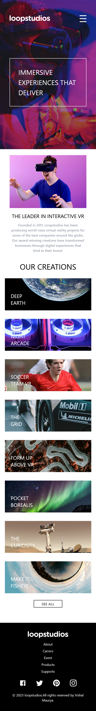

# Frontend Mentor - Loopstudios landing page solution

This is a solution to the [Loopstudios landing page challenge on Frontend Mentor](https://www.frontendmentor.io/challenges/loopstudios-landing-page-N88J5Onjw).

## Table of contents

- [Frontend Mentor - Loopstudios landing page solution](#frontend-mentor---loopstudios-landing-page-solution)
  - [Table of contents](#table-of-contents)
  - [Overview](#overview)
    - [The challenge](#the-challenge)
    - [Screenshot](#screenshot)
    - [Links](#links)
  - [My process](#my-process)
    - [Built with](#built-with)
    - [What I learned](#what-i-learned)
    - [Continued development](#continued-development)
    - [Useful resources](#useful-resources)
  - [Author](#author)


## Overview

### The challenge

- there is no difficulty but I feel some difficulties for creating grid wihich is middle section and problem is that ,we have two different  images  and we want pass both images by using  props.


### Screenshot

| Desktop                                                                       | Mobile                                                                        |
| ----------------------------------------------------------------------------- | ----------------------------------------------------------------------------- |
|  |  |


### Links

- Solution URL: [View Code](https://github.com/VishalMauryastp/loopstudios-landing-page-main)
- Live Site URL: [Preview](https://vishalmauryastp.github.io/loopstudios-landing-page-main/)

## My process

### Built with

- Semantic HTML5 markup
- CSS custom properties
- Tailwind Css
- Flexbox
- CSS Grid
- Mobile-first workflow
- [React](https://reactjs.org/) - JS library


### What I learned

- In this i'm using display grid for making a grid its helful.
```css
.grid {
 display:grid;
}
```


### Continued development

- While I'm starting to create this design then I created desktop view first after that I created the mobile view by sing media query.


### Useful resources

- [figma](https://www.figma.com) - This helped me for masuring the design width, height ,margin and padding. I really liked this .
- [React Icons](https://react-icons.github.io/react-icons) - this is amazing website which provide icons .


## Author
- Gitgub - [@Vishal Mauruya](https://github.com/VishalMauryastp)
- Frontend Mentor - [@Vishal Mauruya](https://www.frontendmentor.io/profile/VishalMauryastp)
- LinkedIn - [@Vishal Maurya](https://www.linkedin.com/in/in-vishalmaurya/)
- Instagram-[@Vishal Maurya](https://www.instagram.com/VishalMauryastp)
